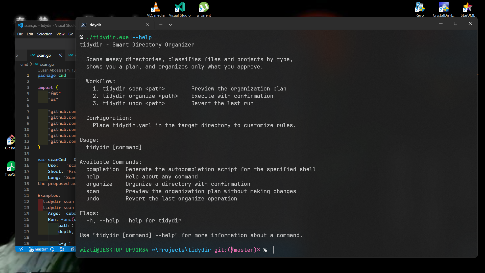
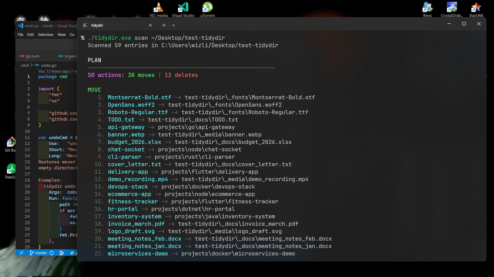

<p align="center">
  
</p>

# tidydir

[](https://github.com/wizli595/tidydir/actions/workflows/ci.yml)
[](https://go.dev)
[](LICENSE)
[]()
[](https://github.com/wizli595/tidydir/releases)

A CLI tool that scans messy directories, classifies files and projects by type, proposes an organization plan, and executes only what you approve.

---

## Table of Contents

- [Screenshots](#screenshots)
- [Features](#features)
- [Install](#install)
- [Commands](#commands)
  - [scan](#scan)
  - [organize](#organize)
  - [undo](#undo)
  - [watch](#watch)
  - [schedule](#schedule)
  - [completion](#completion)
- [Flags Reference](#flags-reference)
- [How it Works](#how-it-works)
- [Classification Rules](#classification-rules)
- [Output Structure](#output-structure)
- [Configuration](#configuration)
  - [Profiles](#profiles)
  - [Custom Classifiers](#custom-classifiers)
- [Architecture](#architecture)
- [Dependencies](#dependencies)
- [Contributing](#contributing)
- [License](#license)

---

## Screenshots

<p align="center">
  
</p>

<p align="center">
  
</p>

## Features

- **Smart classification** — detects dev projects (Go, Node, Java, Flutter, .NET, Python, Rust, Docker, Django), documents, media, fonts, archives, duplicates, and junk files
- **Insights engine** — flags large files, old projects, dirty git repos, heavy dependency dirs (node_modules, vendor), and naming issues
- **Naming normalization** — suggests kebab-case renames for files with spaces, mixed case, or underscores
- **Non-destructive** — deletes go to a trash folder (or system trash), every action is logged for undo
- **Interactive TUI** — navigate the plan with arrow keys, toggle actions with space, confirm with enter
- **Configurable** — YAML-based rules, custom classifiers, profiles, ignore lists, configurable folder names and thresholds
- **Multi-directory** — scan or organize multiple directories in one command
- **Export** — output plans as JSON or CSV for external review
- **Recursive scanning** — optional depth control with `--depth` flag
- **Dry-run mode** — preview changes without executing
- **System trash** — optional integration with Windows Recycle Bin, macOS Trash, Linux XDG trash
- **Scheduled scans** — set up periodic checks with desktop notifications
- **Shell completions** — bash, zsh, fish, powershell
- **Tested** — 58 unit tests across 8 internal packages

## Install

```bash
go install github.com/wizli595/tidydir@latest
```

Or build from source:

```bash
git clone https://github.com/wizli595/tidydir.git
cd tidydir
go build -o tidydir .
```

## Commands

### scan

Preview the organization plan without making any changes.

```bash
tidydir scan <path> [paths...]
```

**Examples:**

```bash
tidydir scan ~/Documents                  # scan a single directory
tidydir scan ~/Documents ~/Downloads      # scan multiple directories
tidydir scan ~/Documents --depth 2        # recursive scan (2 levels deep)
tidydir scan ~/Documents --format json    # export plan as JSON
tidydir scan ~/Documents --format csv     # export plan as CSV
tidydir scan ~/Documents --profile work   # use a named config profile
```

Shows classified entries, insights (large files, old projects, dirty repos, naming issues), and the proposed action plan.

---

### organize

Scan, display the plan, ask for confirmation via interactive TUI, then execute approved actions.

```bash
tidydir organize <path> [paths...]
```

**Examples:**

```bash
tidydir organize ~/Documents                    # organize with TUI confirmation
tidydir organize ~/Documents ~/Downloads        # organize multiple directories
tidydir organize ~/Documents --dry-run          # preview without executing
tidydir organize ~/Documents --depth 1          # include one level of subdirectories
tidydir organize ~/Documents --system-trash     # send deletes to OS trash
tidydir organize ~/Documents --profile work     # use named profile
```

**Interactive TUI controls:**

| Key | Action |
|-----|--------|
| Up / k | Move cursor up |
| Down / j | Move cursor down |
| Space | Toggle action on/off |
| a | Select all |
| n | Deselect all |
| Enter | Confirm and execute selected |
| q / Esc | Abort |

---

### undo

Reverse the last organize operation. Restores moved files and recovers trashed items.

```bash
tidydir undo <path>
```

**Example:**

```bash
tidydir undo ~/Documents
```

Reads the `.tidydir_undo.json` log in reverse (LIFO), restores files to original locations, and cleans up empty directories.

---

### watch

Monitor a directory for changes in real time. Reports when new files need organizing.

```bash
tidydir watch <path>
```

**Example:**

```bash
tidydir watch ~/Downloads
```

Uses filesystem events (fsnotify) with a 2-second debounce. Shows a status line each time the directory state changes. Press Ctrl+C to stop.

---

### schedule

Set up scheduled auto-scans with desktop notifications.

```bash
tidydir schedule <path>
```

**Examples:**

```bash
tidydir schedule ~/Documents               # show setup instructions for your OS
tidydir schedule ~/Documents --run         # run a single check and notify if messy
tidydir schedule ~/Documents --every 2h    # generate command for 2-hour interval
```

On Windows, generates a `schtasks` command. On macOS/Linux, generates a crontab entry. The `--run` flag performs a single scan and sends a desktop notification if the directory needs organizing.

---

### completion

Generate shell completion scripts.

```bash
tidydir completion <shell>
```

**Examples:**

```bash
tidydir completion bash > /etc/bash_completion.d/tidydir
tidydir completion zsh > ~/.zsh/completions/_tidydir
tidydir completion fish > ~/.config/fish/completions/tidydir.fish
tidydir completion powershell > tidydir.ps1
```

---

## Flags Reference

| Flag | Command | Description |
|------|---------|-------------|
| `--depth N` | scan, organize | Recursion depth (0 = top-level only) |
| `--dry-run` | organize | Show plan without executing |
| `--format` | scan | Output format: `text` (default), `json`, `csv` |
| `--profile` | scan, organize | Named config profile to use |
| `--system-trash` | organize | Use OS trash instead of `.tidydir_trash` |
| `--run` | schedule | Run a single check and send notification |
| `--every` | schedule | Interval for scheduled checks (e.g. `30m`, `1h`) |
| `--help` | all | Show help for any command |

## How it Works

```
Scanner -> Classifiers (Strategy pattern) -> Insights -> Planner -> UI (TUI confirm) -> Executor -> Summary
```

1. **Scanner** reads directory entries, respects ignore patterns, supports recursive depth
2. **Classifiers** run in priority order (junk > duplicates > projects > custom > file types). First match wins.
3. **Insights** analyzes entries for warnings: large files, old projects, dirty git repos, heavy deps, naming issues
4. **Planner** converts classifications into concrete actions (move, delete, rename), applies custom rules
5. **UI** displays the plan with colored output and collects user approval via interactive TUI
6. **Executor** runs approved actions, writes undo log, reports summary stats

## Classification rules

| Category | Detection method |
|----------|-----------------|
| Project | Marker files: `go.mod`, `package.json`, `Cargo.toml`, `pom.xml`, `pubspec.yaml`, `*.csproj`, `docker-compose.yml`, `manage.py`, etc. |
| Document | Extensions: `.pdf`, `.docx`, `.xlsx`, `.csv`, `.html`, `.txt`, `.pptx` |
| Media | Extensions: `.png`, `.jpg`, `.mp4`, `.mp3`, `.svg`, `.gif`, `.webp` |
| Font | Extensions: `.ttf`, `.otf`, `.woff`, `.woff2` |
| Archive | Extensions: `.zip`, `.tar`, `.gz`, `.rar`, `.7z` |
| Duplicate | Zip with matching extracted folder, `(1)` / `- Copy` in filename |
| Junk | `.DS_Store`, `Thumbs.db`, `node_modules`, `.cache` |

## Output structure

After organizing, your directory will look like:

```
Documents/
  projects/
    go/
    node/
    java/
    flutter/
    docker/
  _docs/
  _media/
  _fonts/
  _archives/
  .tidydir_trash/    # soft-deleted files (duplicates, junk)
  .tidydir_undo.json # undo log
```

## Configuration

Place a `tidydir.yaml` or `.tidydir.yaml` in the target directory to override defaults:

```yaml
folders:
  project: "projects"
  document: "_docs"
  media: "_media"
  font: "_fonts"
  archive: "_archives"

project_markers:
  - file: "docker-compose.yml"
    type: "docker"
  - file: "manage.py"
    type: "django"

ignore:
  - "desktop.ini"
  - "*.lnk"
  - "My Music"

custom_rules:
  - pattern: "*.sketch"
    dest: "_design"

large_file_mb: 100       # flag files larger than this (default: 100)
old_project_days: 180    # flag projects not modified in this many days (default: 180)
```

### Profiles

Define named profiles for different use cases. Activate with `--profile <name>`:

```yaml
profiles:
  work:
    folders:
      project: "work-projects"
    large_file_mb: 500
    ignore:
      - "*.personal"
  personal:
    folders:
      project: "hobby"
    old_project_days: 365
```

```bash
tidydir organize ~/Documents --profile work
```

### Custom Classifiers

Define your own classification rules (plugin system). These run before the built-in filetype classifier:

```yaml
custom_classifiers:
  - name: "data-files"
    extensions: [".parquet", ".avro", ".feather"]
    category: "document"
    subtype: "data"
  - name: "log-files"
    patterns: ["*.log", "*.log.*"]
    category: "junk"
  - name: "design-assets"
    extensions: [".sketch", ".fig", ".xd"]
    category: "media"
    subtype: "design"
```

Supported fields:
- `extensions` — match by file extension (case-insensitive)
- `patterns` — match by filename glob pattern
- `category` — target category (project, document, media, font, archive, junk)
- `subtype` — optional subtype for folder grouping

## Architecture

```
tidydir/
  cmd/              # CLI commands (scan, organize, undo, watch, schedule, completion)
  internal/
    scanner/        # Directory walking with ignore and depth
    classifier/     # Strategy pattern: junk, duplicate, project, custom, filetype
    config/         # YAML config loader with profiles and defaults
    planner/        # Converts classifications to actions, applies custom rules
    insights/       # Intelligence: large files, old projects, git status, naming
    export/         # JSON/CSV plan export
    action/         # Action type definitions
    executor/       # Runs actions, writes undo log, system trash, rollback
    ui/             # Bubbletea TUI, terminal output, insights display
  config/           # Default YAML rule definitions
```

## Dependencies

- [cobra](https://github.com/spf13/cobra) — CLI framework
- [bubbletea](https://github.com/charmbracelet/bubbletea) — Interactive TUI
- [lipgloss](https://github.com/charmbracelet/lipgloss) — Terminal styling
- [termenv](https://github.com/muesli/termenv) — Dark/light terminal detection
- [fsnotify](https://github.com/fsnotify/fsnotify) — File system watching
- [yaml.v3](https://gopkg.in/yaml.v3) — Configuration parsing

## Contributing

Contributions are welcome. See [CONTRIBUTING.md](CONTRIBUTING.md) for guidelines on how to get started.

## License

This project is licensed under the MIT License. See [LICENSE](LICENSE) for details.
